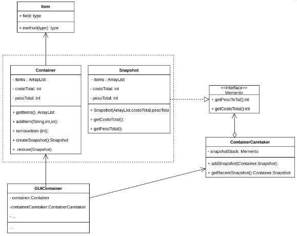
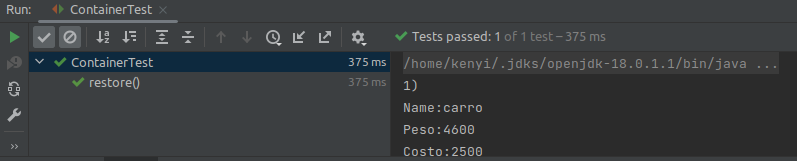

# ExamenFinalGrupoTHeCoffee
| Integrantes                            |
|----------------------------------------|
| ALCANTARA ASTETE KENYI HERRY 20180343C |
||
||
|CHAUCA DE LA CRUZ ANGEL 20182666D|

#### 3. Descripción del problema a resolver:

El problema consiste en realizar un programa que gestione la logística de envío de productos.
Imagenes que su empresa de logística está encargada en la  distribución de  diversos productos peruanos hacia el resto de países. Entonces tiene dos formas de enviar una lista de productos en un container.  Dependiendo del peso, el programa seleccionará el modo de envío (Barco o avión) y en un formato de envío del container determinado.

#### 4. Soluciones y resultados encontrados:
   La solución la dividimos en tres pasos:
   >**La forma de realizar el listado de los ítems:**
   En esta parte, un trabajador de su empresa puede enlistar los Ítems en un container para un determinado destino previsto.  Pero puede ocurrir que el trabajador ingrese algunos ítems que no tenían el destino previsto del container, entonces el programa debe tener la opción de eliminar esos ítems del listado. Pero puede ocurrir que el trabajador elimine los ítems incorrectos, entonces el programa debe tener la capacidad de retroceder a un estado anterior, es decir deshacer el acto realizado. Es decir debe tener la capacidad de guardar historiales. Para ello se implementa el patrón de comportamiento Memento, para dar solución a la gerencia, administración y almacenamiento de los historiales de lo enlistados en el tiempo.
   
>**Selección del modo de envío, dependiendo de un parámetro específico:**
   Una vez que el trabajador ya enlisto correctamente los ítems a enviar en un container a un destino determinado. El programa debe tener la capacidad de seleccionar internamente mediante un parámetro específico, establecido por la lógica de negocio de su empresa, el cual puede ser la que minimice los costos o maximice la rapidez de envío. En nuestro caso elegimos la que maximice la rapidez y esto se logra cuando se envía en un avión, en comparación al envío por un barco. Para ello se envía en avión todos los enlistados en un container que no supere la capacidad máxima de carga de un avión. De lo contrario se estaría enviado en un barco.
   Esto nos da la necesidad de implementar el patrón creacional Factory-method, de tal manera que se pueda tener dos formas de envío del container (En un futuro también podemos agregar otros métodos de envío). Que el mismo programa las utilice en su decisión.  

>**El formato del container a aplicar:**
   Luego de tener ya el container listo para enviar a un destino y el modo de su envío, se debe elegir un formato para este container. ¿A qué me refiero con el formato? Si bien es cierto que los ítems físicos en el container viajan por un medio de transporte determinado hacia su destino,  el sistema tiene que hacer saber, a la otra estación receptora en el otro país, los ítems enviados en un determinado container con los datos adicionales que la describen.  Esta información se debe enviar en un formato elegido, que en este caso seleccionamos JSON. Para ello el programa debe consumir una librería externa llamada Gson, para hacer la conversión del objeto java Container a su forma Json equivalente.
   Esta necesidad de consumir una librería externa nos da la necesidad de aplicar el patrón estructural Facade, de tal manera que se tenga una interfaz sencilla para consumir esta librería. Evitando consumir directamente.   

#### 6. Patrones de diseño:

>Memento:



>Clase Item: define los ítems que se enlistan en un container
```java
public class Item {
   private String name;
   private int costo;
   private int peso;

   public Item(String name, int costo, int peso) {
      this.name = name;
      this.peso = peso;
      this.costo = costo;
   }

   public int getCosto() {
      return costo;
   }

   public String getName() {
      return name;
   }

   public int getPeso() {
      return peso;
   }
}
```


>Interfaz Memento: Interfaz que es implementado por Snapshot. Esta interfaz define sólo los métodos que se pueden utilizar sin modificar el historial en sí.   
```java
//Interfaz memento: Defino sólo los métodos que se pueden hacer sin modificar el historial en sí. 
public interface Memento{
   int getPesoTotal();
   int getCostoTotal();
}

```

>Clase Container: Responsable de instanciar containers que enlistan Items. Esta tiene una clase interna Snapshot , que se utiliza para autogenerarse copias de sí misma, las cuales serán almacenadas en la cuidadora de historiales ContainerCarateker.
```java
public class Container {

   private ArrayList<Item> items = new ArrayList<>();
   private int costoTotal = 0;
   private int pesoTotal = 0;

   public ArrayList<Item> getItems() {
       return items;
   }

   public void addItem(String name,int costo,int peso){
       items.add(new Item(name,costo,peso));
       this.costoTotal=this.costoTotal+costo;
       this.pesoTotal = this.pesoTotal+peso;
   }

   public void removeItem (int indexRelative){
       this.costoTotal=this.costoTotal- this.items.get(indexRelative).getCosto();
       this.pesoTotal = this.pesoTotal-this.items.get(indexRelative).getPeso();
       items.remove(indexRelative);
   }

   public int getPesoTotal() {
       return pesoTotal;
   }

   public int getCostoTotal() {
       return costoTotal;
   }

   //Clase interna: Crea instancias que son copias de containers.
     //Es definida INTERNA debido a que solo la clase Container debe tener acceso a su Historial. 
   static class Snapshot implements Memento{
       private ArrayList<Item> items;
       private final int costoTotal;
       private final int pesoTotal;
       Snapshot(ArrayList<Item> items, int costoTotal, int pesoTotal){
           this.costoTotal=costoTotal;
           this.items = new ArrayList<>(items);
           this.pesoTotal=pesoTotal;
       }

       public int getCostoTotal() {
           return costoTotal;
       }
       public int getPesoTotal() {
           return pesoTotal;
       }
   }

   //Crea una copia
   public Snapshot createSnapshot(){
       showINTHeConsole();
       System.out.println("Snapshot creado:");
       showINTHeConsole();
       return new Snapshot(this.items,this.costoTotal,this.pesoTotal);
   }

   //Restaura de una copia
   public void restore(Snapshot snapshot){
       //Verificando si existe un historial guardado
       if (snapshot != null){
           this.items=snapshot.items;
           this.costoTotal=snapshot.costoTotal;
           this.pesoTotal = snapshot.pesoTotal;
     
       }else{
           System.out.println("No hay historial de donde recuperar!");
       }
   }
}

```

>Clase ContainerCarataker: Almacena el historial(Snapshots) de los containers, pero esta clase no tiene acceso a estos historiales. Es decir, no puede obtener datos , ni manipularlos de los historiales.

```java
public class ContainerCaretaker {
   private final  Stack<Memento> snapshotStack = new Stack<>();
   public void addSnapshot(Memento snapshot){
       snapshotStack.push(snapshot);
   }

   public Container.Snapshot getRecentSnapshot(){
       if(snapshotStack.empty()){
           return null;
       }
       return (Container.Snapshot) snapshotStack.pop();
   }
}

```


#### 7. Pruebas del sistema  
>Test de restauración de historial:

Agregaremos tres ítems al container. Luego crearemos una Snapshot para ese estado del container.
Luego eliminaremos un ítem y diremos que fue el ítem equivocado. Pero como tenemos la posibilidad de regresar al historial anterior. Ejecutaremos la restauración y verificaremos que el ítem eliminado aún está en el container. 

``` java
class ContainerTest {
   @Test
   void restore() {
       //Creamos un container
       Container container = new Container();
       //Creamos la cuidadora del historial
       ContainerCaretaker containerCaretaker = new ContainerCaretaker();

       //Agrego item 1
       container.addItem("carro",2500,4600);
       //Agrego item 2
       container.addItem("lavadora",250,200);
       //Agrego item 3
       container.addItem("Dron",1000,20);

       //Creamos una snapshot
       containerCaretaker.addSnapshot(container.createSnapshot());

       //¿Qué pasaría si eliminamos el item 2 de index = 1?
       container.removeItem(1); // ¡Ho no! eliminamos el item equivocado

       //Restauremos la historial
       container.restore(containerCaretaker.getRecentSnapshot());

       //Verificando que el item 2 aún está en la lista
       assertEquals("lavadora",container.getItems().get(1).getName());
   }
}

``` 

#### 9. Programación GUI  
>GUIApp:
>Esta clase define la ventana principal donde se realiza el 50% de la funcionalidad total del software, presenta dos botones
>, uno para agregar items y el otro para enviar el producto.


```
public class GUIApp extends JFrame {
    private JButton enviar;
    private JButton enlistarItemsButton;
    private JPanel PanelAppPrincipal;
    private JLabel mensajeDeTipoDeEnvio;
    private JPanel panelMensaje;
    private JPanel topPanel;
    private JPanel mainPanel;

    private GUIContainer guiContainer;

    //Tipo de envío con el patron factory.method
    private  LogisticaAvion logisticaAvion = new LogisticaAvion();
    private static GUIApp guiApp;

    public static void main(String[] args) {

        //Inicio de app
        guiApp= new GUIApp();

    }

    public GUIApp(){


        PanelAppPrincipal.setLayout(new BorderLayout());
        PanelAppPrincipal.add(topPanel,BorderLayout.NORTH);
        PanelAppPrincipal.add(mainPanel,BorderLayout.CENTER);
        PanelAppPrincipal.add(panelMensaje,BorderLayout.SOUTH);

        setContentPane( PanelAppPrincipal);
        setDefaultCloseOperation(JFrame.EXIT_ON_CLOSE);
        setBounds(250,100,720,520);
        setBounds(250,100,820,620);
        setVisible(true);
        enlistarItemsButton.addActionListener(new ActionListener() {
            @Override
            public void actionPerformed(ActionEvent e) {
                guiContainer = new GUIContainer();
            }
        });
        enviar.addActionListener(new ActionListener() {
            @Override
            public void actionPerformed(ActionEvent e) {
                enviarContainer();
            }
        });
    }
    private void enviarContainer(){
        //Obtenemos el tipo de envío dependiendo el container enlistado en el patron memento
        Envio envio = logisticaAvion.getEnvio(guiApp.guiContainer.getContainer());

        //Mostrando mensaje de envío
        guiApp.mensajeDeTipoDeEnvio.setText(envio.enviar());
    }
}

```
>GUIContainer:
>Agregar ítems,  estos ítems tienen un nombre, su costo  y un peso.
>Si desea puede eliminar un item agregado , pero si quiere volver en el tiempo, solo tiene que presionar el botón “deshacer”. 
>Le invito agregar tres ítems cualesquiera, eliminar el intermedio y presionar el “deshacer” y verificar que pasa.
>Luego de estar seguro de la lista que quiere enviar. Presiona Finalizar. 

```
public class GUIContainer extends JFrame {
    private JTextField textFieldName;
    private JButton addItemButton;
    private JTextField textFieldCosto;
    private JTextField textFieldPeso;
    private JPanel PanelInputItem;
    private JPanel PanelShowItems;
    private JPanel PanelContainer;
    private JButton FinishedButton;
    private JButton deshacerButton;
    Container container = new Container();
    ContainerCaretaker containerCaretaker = new ContainerCaretaker();
    public GUIContainer(){
        setContentPane(PanelContainer);

        setDefaultCloseOperation(JFrame.EXIT_ON_CLOSE);
        setBounds(250,100,720,520);
        setBounds(250,100,820,620);
        setVisible(true);


        PanelShowItems.doLayout();
        PanelShowItems.setLayout(new BoxLayout(PanelShowItems,BoxLayout.Y_AXIS));

        FinishedButton.addActionListener(new ActionListener() {
            @Override
            public void actionPerformed(ActionEvent e) {
                setVisible(false);
            }
        });

        addItemButton.addActionListener(new ActionListener() {
            @Override
            public void actionPerformed(ActionEvent e) {
                //Antes de agregar se toma un snapshot y guardamos en la containerCaretaker
                containerCaretaker.addSnapshot(container.createSnapshot());

                //Agrego un item
                container.addItem(textFieldName.getText(),Integer.parseInt(textFieldCosto.getText()),Integer.parseInt(textFieldPeso.getText()));

                showItemsGui();

                //Limpiando campos
                textFieldName.setText("");
                textFieldCosto.setText("");
                textFieldPeso.setText("");
            }
        });
        deshacerButton.addActionListener(new ActionListener() {
            @Override
            public void actionPerformed(ActionEvent e) {
                //Si presionamos deshacer, volvemos a un snapshot anterior.
                container.restore(containerCaretaker.getRecentSnapshot());
                showItemsGui();
            }
        });
    }

    private void showItemsGui(){

        //Limpiando la anterior lista
        PanelShowItems.removeAll();
        //Mostrando todos lis items actuales
        int idRelative = 0;
        for (Item item: container.getItems()) {
            int finalIdRelative = idRelative;
            //Creando panel item
            JPanel PanelOneItem= new JPanel();
            JLabel labelName = new JLabel();
            JLabel labelCosto = new JLabel();
            JLabel labelPeso = new JLabel();
            JLabel countLabel = new JLabel();

            countLabel.setText(String.valueOf(finalIdRelative+1)+". ");

            labelName.setText("Name:");
            labelCosto.setText("Costo:");
            labelPeso.setText("Peso:");

            JLabel labelNameItem = new JLabel();
            JLabel labelCostoItem = new JLabel();
            JLabel labelPesoItem=new JLabel();
            JButton buttonDeleteItem = new JButton();
            buttonDeleteItem.setText("Delete");
            buttonDeleteItem.addActionListener(new ActionListener() {
                @Override
                public void actionPerformed(ActionEvent e) {

                    //Elimino un item
                    removeItemToContainer(finalIdRelative);
                }

            });
            idRelative++;
            //Poniendo color
            PanelOneItem.setBackground(new Color(51,153,255));

            //Configurando valores para mostrar
            labelNameItem.setText(item.getName());
            labelCostoItem.setText(String.valueOf(item.getCosto()));
            labelPesoItem.setText(String.valueOf(item.getPeso()));

            //Agregando los labels al PanelOneItem
            PanelOneItem.add(countLabel);
            PanelOneItem.add(labelName);
            PanelOneItem.add(labelNameItem);
            PanelOneItem.add(labelCosto);
            PanelOneItem.add(labelCostoItem);
            PanelOneItem.add(labelPeso);
            PanelOneItem.add(labelPesoItem);
            PanelOneItem.add(buttonDeleteItem);

            //Agregando el panel model.memento.Item al PanelShowItems
            PanelShowItems.add(PanelOneItem);
            PanelShowItems.revalidate();
            PanelShowItems.repaint();

        }
    }

    private void removeItemToContainer( int idRelative){
        //Cada que eliminas un item se toma un snapshot y guardamos en la containerCaretaker
        containerCaretaker.addSnapshot(container.createSnapshot());

        //Elimino el item
        container.removeItem(idRelative);
        showItemsGui();
    }

    public Container getContainer() {
        return container;
    }
}

```

